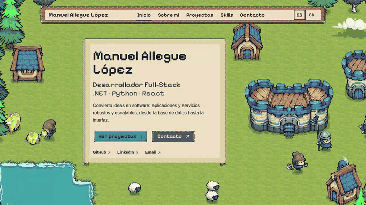
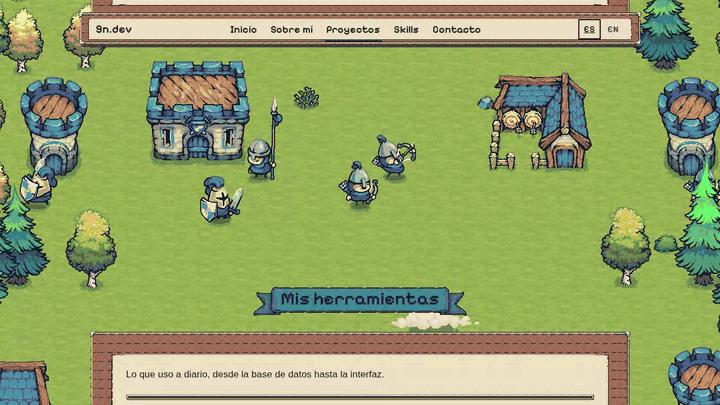
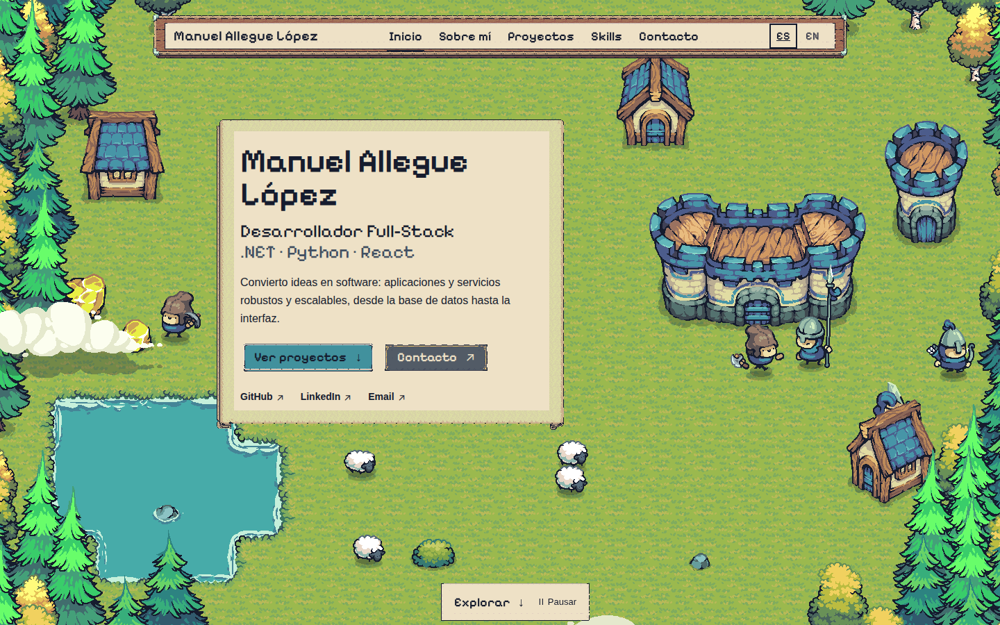
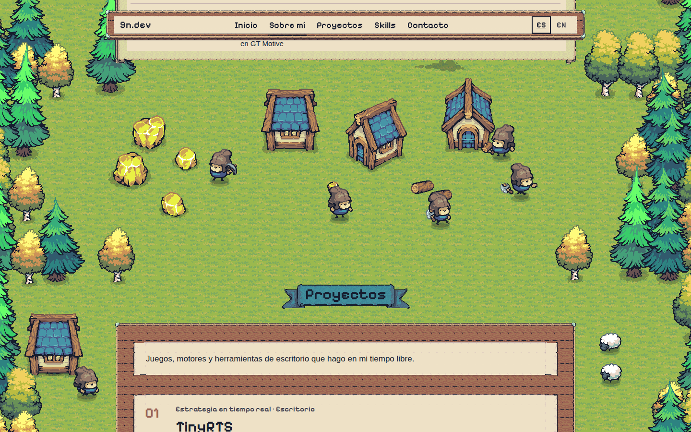
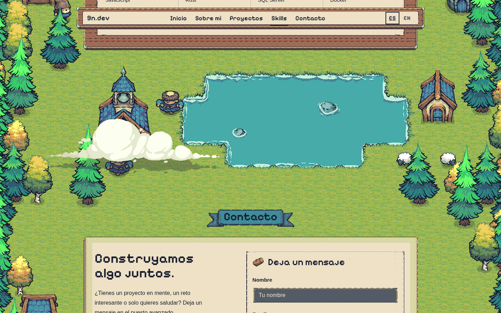
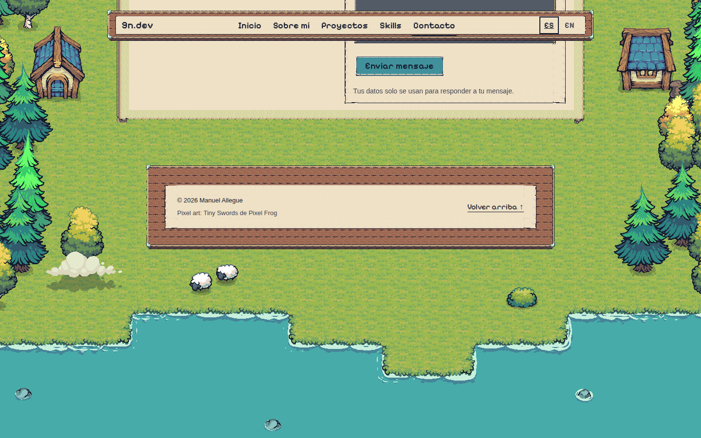
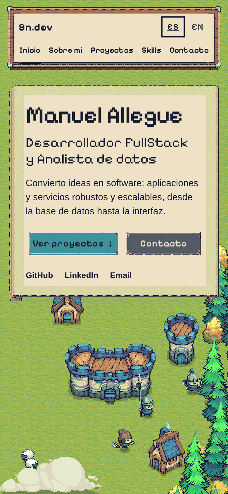
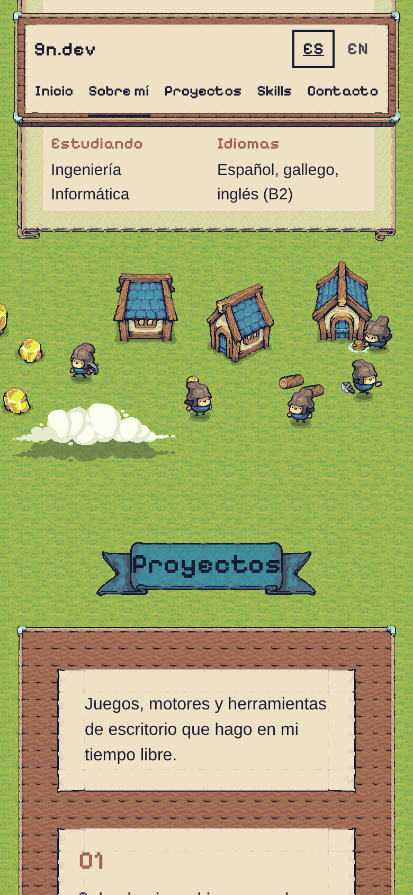
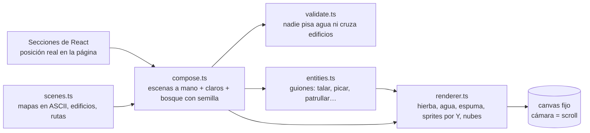

<div align="center">

# TinyPortfolio

**Mi portfolio, dentro del mundo de mi propio juego.**<br>
La interfaz es la de un RTS en pixel art y, detrás, una aldea de [TinyRTS](https://github.com/9n-dev/TinyRTS-showcase) sigue con su vida.

### [Verlo en vivo: 9n-dev.github.io/TinyPortfolio](https://9n-dev.github.io/TinyPortfolio/)


[](https://github.com/9n-dev/TinyPortfolio/actions/workflows/pages.yml)




</div>

---

## Qué es

Un portfolio de una sola página (inicio, sobre mí, proyectos, skills y contacto) en español e inglés. Los paneles son los
tablones, pergaminos, cintas y botones del pack **Tiny Swords**, montados pieza a pieza para que las esquinas nunca se
deformen. El fondo no es una imagen: es un mundo simulado que se pinta en un `<canvas>` y cuya cámara baja con el scroll.

- Estanques y costa con espuma animada, rocas en el agua y nubes que pasan.
- Bosque cerrado en los bordes, con cada árbol meciéndose a su ritmo.
- Mineros que pican oro y vuelven cargados, leñadores que talan y acarrean madera, constructores martilleando.
- Ovejas que pastan, guerreros, lanceros y arqueros de patrulla, monjes que pasean y curan.
- Arqueros que disparan flechas de verdad a las dianas del campo de tiro.
- Cada sección tiene su escena: castillo y aldea, casas junto al estanque, mina y talleres, cuartel, monasterio junto
  al lago; y bajo el pie de página el mapa termina en el mar.

Sin motor de juego ni librerías de animación: React, TypeScript, Vite y unas 750 líneas de mundo, escenas incluidas.

<div align="center">

</div>

## Capturas

| | |
| :---: | :---: |
| <br>Portada | <br>Mina y talleres, antes de Proyectos |
| <br>Monasterio y lago, antes de Contacto | <br>El mapa acaba en el mar |

<div align="center">
&nbsp;&nbsp;

<br>En móvil el mundo se pinta a media escala y la aldea se recoloca bajo el pergamino.
</div>

## Cómo funciona el mundo



- **El mapa se adapta a la página, no al revés.** La altura cambia con el idioma, el ancho o el número de proyectos, así
  que el mundo se compone al cargar a partir de dónde han quedado las secciones: la escena de portada arriba, una franja
  en el hueco sobre cada sección, la costa al final, claros 3×3 junto a los paneles largos y bosque de relleno con
  semilla fija (el mismo en cada visita).
- **Las escenas se escriben como mapas ASCII** (`.` hierba, `~` agua, `T` árbol…) más una lista de edificios y actores
  con sus rutas. Un validador comprueba que ninguna ruta pisa agua ni atraviesa un edificio; mientras diseñaba cazó a un
  monje cruzando el monasterio.
- **Los comportamientos son guiones** con generadores: `ir → trabajar → volver cargado → descansar`. Sin pathfinding:
  líneas rectas entre puntos elegidos a mano.
- **El terreno usa el autotile de TinyRTS** (solo bordes convexos, como el tileset) y la espuma va desfasada por casilla.
- **El canvas hace scroll con la página.** Es algo más alto que la pantalla y forma parte del documento, así que el
  navegador lo desplaza junto a los paneles en el hilo del compositor; en cada frame se recoloca alrededor de la pantalla
  y se repinta. Un canvas fijo repintado desde `scrollY` va a tirones en móvil, donde el scroll no espera a JavaScript.
- **Barato:** 0,7 ms de script por frame a 1920×1080, 560 KB de sprites. Se detiene con la pestaña oculta y con
  `prefers-reduced-motion`; el mundo arranca ya presimulado, así que el frame fijo también tiene vida.

## Desarrollo

```sh
npm install
npm run dev        # http://localhost:5173
npm run build      # sitio estático en dist/
npm run test:e2e   # arranca su propio servidor en el puerto 5183
npm run media      # regenera docs/media (necesita ffmpeg)
```

Node 22. La primera vez, `npx playwright install chromium`.

### Estructura

```
src/
  world/        el mundo: scenes, compose, validate, entities, renderer, WorldCanvas
  content/      todo el texto visible: en.ts y es.ts (es tipado con el tipo de en)
  sections/     Home, About, Projects, Skills, Contact
  components/   paneles nine-slice, botones, navegación con selector de idioma
  data/         siteConfig.ts: nombre, email, redes, endpoint del formulario
  styles/       global.css, ui.css (nine-slice), home.css
scripts/        prepare-assets.py (extrae los PNG del pack), record-media.mjs
tests/          world.spec.ts (sin navegador), portfolio.spec.ts, visual-review.spec.ts
docs/           auditoría de assets, referencia de arte, diseño y plan
```

### Cambiar el contenido

| Qué | Dónde |
| --- | --- |
| Textos, proyectos y skills | `src/content/en.ts` y `src/content/es.ts` (si falta una clave en español, no compila) |
| Nombre, email, redes, formulario | `src/data/siteConfig.ts` |
| El paisaje | `src/world/scenes.ts`, y luego `npx playwright test tests/world.spec.ts` |

Un proyecto es `{ name, category, description, stack, url?, sourceUrl?, image? }`; los botones solo aparecen si hay URL.
Un portátil de 1440 px enseña las columnas 4–26 de cada escena y un móvil las 9–21, así que lo importante va en el centro.
La altura de las franjas la reserva el `margin-top` de las secciones en `global.css`.

### Formulario de contacto

Sin endpoint valida y avisa de que no envía nada. Para activarlo, crea un formulario en [Formspree](https://formspree.io)
y pon su URL en `contactEndpoint`. Envía un POST JSON con timeout y gestión de errores, y lleva un campo trampa contra bots.

## Pruebas

36 tests con Playwright. Sin navegador: autotile, composición del mundo a 4 anchuras × 3 alturas, validador y
comportamientos. En Chromium: sin overflow ni errores de consola de 1728 a 320 px, navegación activa, formulario, que el
mundo se pinta y se mueve, que queda fijo con movimiento reducido, que el canvas hace scroll con la página y cubre
siempre la pantalla, idioma (cambio, persistencia y detección),
teclado y coste por frame. Pendiente: Safari, Firefox, lector de pantalla y móviles físicos.

## Despliegue

`.github/workflows/pages.yml` compila y publica en GitHub Pages en cada push a `main`, con `BASE_PATH=/<repo>/`. En Vercel
o en un dominio raíz no hace falta nada: sin `BASE_PATH` la base es `/`. Las rutas a `public/` pasan por `asset()` o por
`url()` en CSS, que Vite reescribe.

## Créditos y licencia

- Arte: **[Tiny Swords](https://pixelfrog-assets.itch.io/tiny-swords)** de **Pixel Frog**. El pack original no está en el
  repositorio; solo los PNG que la web usa. El arte no está cubierto por la licencia de este repo: se rige por la de su autor.
- Tipografía: [Pixelify Sans](https://fonts.google.com/specimen/Pixelify+Sans) (OFL), servida en local.
- Código: [MIT](LICENSE).
- Desarrollado con [Claude Code](https://claude.com/claude-code); el diseño y el plan están en `docs/superpowers/`.
